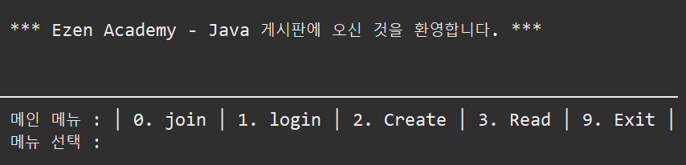
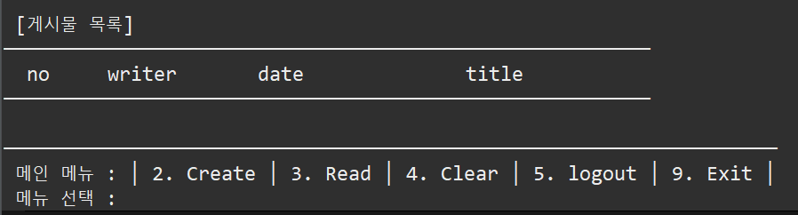
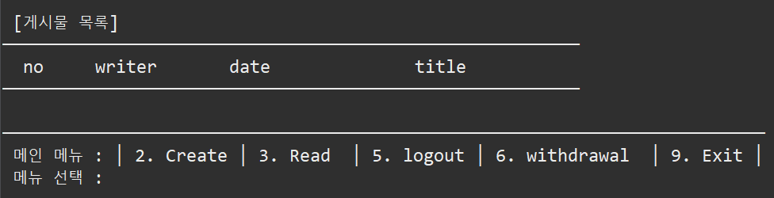
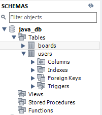
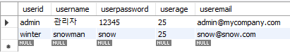
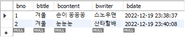
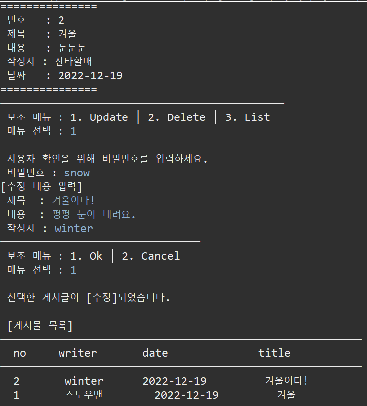
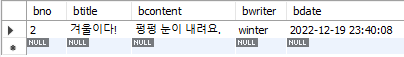
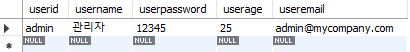

# 게시판(console)

## 자바 개인 프로젝트 JAVA PROJECT    
---
<br>

## ✔ 프로젝트 소개 
💡 `#JAVA`와 `#JDBC`(MySQL)를 이용하여 만든 **JAVA 게시판만들기 프로젝트**  
- 개발기간 : 2022-12-18 ~ 22-12-20

- 개발환경 : Windows 10

- 개발도구 : 

- 프로젝트 성격 : JAVA 콘솔 프로젝트 

- 프로젝트 목표 : CRUD 기능이 포함된 게시판이 명령 프롬프트(윈도우)에서 실행되도록 JDBC를 활용해서 구현하기


---

>**ECLIPSE 환경 구축**

> 1. ECLIPSE 설치
> 2. JDK 설치
> 3. mySQL 설치
> 4. mySQL 라이브러리 설치(mysql-connector-java-8.0.30.jar)
> 5. lombok 설치

---

 > - 참고: 이것이 자바다 - 부록 데이터베이스 입출력(MySQL용) 실습  `<link>` [[ JDBC_mysql ]](https://github.com/MyeongHyeonYoo/JDBC_mysql.git "JDBC_mysql") 
---

<br>

||
|:---|
| 🔘 구현 기능 |
||

<br>

|기능|상세내용
|:---:|:---|
|main   | 등록된 게시글의 전체 목록과 함께 <br>(`회원가입`, `로그인`, `게시글 등록`, `게시글 조회`, `게시글 삭제`, `프로그램 종료`) 메뉴를 보여준다. 
|Join   | 새 사용자를 등록한다.
|Login  | 등록한 아이디와 비밀번호로 로그인을 한다.
|Create | 새로운 게시글을 작성하고 저장한다. 
|Read   | 등록된 게시글의 전체 목록을 보여준다. 
|Update | 등록된 게시글의 제목, 내용, 작성자를 수정한다. 
|Delete | 등록된 게시글을 삭제한다.
|Clear  | 등록된 게시글 전체를 삭제한다. [ 관리자 모드 ]
|Exit   | 프로그램을 종료한다. 


<br><br>

||
|:---|
| 🔘클래스 구조 |
||

<br>

|클래스|상세내용
|---:|:---|
|Board.java|`User`, `Board` 테이블을 저장하는 클래스 <br> (User : 가입정보 │ Board : 게시글)
|Main.java| 회원가입, 로그인, 로그아웃, 게시글 작성 / 수정 / 삭제 / 조회, 게시글의 목록을 보여주고 프로그램을 종료시킬 수 있는 메서드를 가지고 있는 `main` 클래스

<br>

---

<br><br>

| LIST              | MENU            |
| :-----------------:|:----------------|
| 메인 메뉴(공통)   |  |
| 로그인 [관리자]   |  |
| 로그인 [일반회원] |  |

---

## 🖥 실행화면 

<br>

-   **데이터베이스** : `java_db` 생성  + `Tables(boards, users)` 생성

    

    .png)

    (관리자만 존재하는 users DB)

    <br>

    .png)

    (비워 있는 boards DB)

<br><br>

- **회원가입**

    

    

    ▶ 회원가입 완료되어 데이터베이스 입력된 것을 확인 가능 

<br>

- **로그인**

  


<br>

- **게시글 작성**

  

  
  
  ▶ 데이터베이스에 게시글 2개가 작성된 것을 확인 가능(한 번 더 입력하여 2번 내용도 추가)

<br>

- **게시글 보기**

    

    ▶ bno : 해당 게시글의 번호(no)를 선택(입력)하면 게시글을 확인할 수 있다.

<br>

  - **게시글 수정**

    

<br>

  - **게시글 삭제(1행 삭제)**

    

    

    ▶ 데이터베이스 1번이 삭제된 것을 확인 가능

<br>

  - **게시글 목록 보기**

    

<br>

  - **게시글 삭제(전체 삭제) - [관리자 모드]**

    

    ▶ 관리자(admin)만의 실행할 수 있는 기능

<br>

  - **로그아웃**     

    

<br>

  - **회원탈퇴**       

    

    

    ▶ 데이터베이스에서 회원이 삭제된 것을 확인 가능

<br>

  - **시스템 종료** 

    

    .png)

    ▶ 타이머 동작 후 정상 종료

***************

<br>

<b> 💡프로젝트 회고</b>
```
Java로 구현하여 JDBC를 연결하는 과정과 데이터베이스에 CRUD기능을 수행하는 방법을 알아가는 시간이었습니다. 
어떻게 보면 연동을 한다는 것이 어려우면서도, 또 한편으로는 서로 연동하여 CRUD 기능을 수행한다는 것이 매우 흥미로운 과정이었습니다.
많은 시행착오를 겪으면서 다양한 방법과 사고력을 기를 수 있었고, 거듭되는 실패를 성공으로 이루어 내듯 하나하나 성공할 때마다 그 기쁨을 이루 다 말로 표현할 수가 없었습니다. 
이를 통해 한 층 더 성장할 수 있는 계기가 되었으며, 이를 발판 삼아 웹 크리에이터, 유능한 개발자로 성장하길 희망합니다!
```

<br><br><br><br><br><br>

